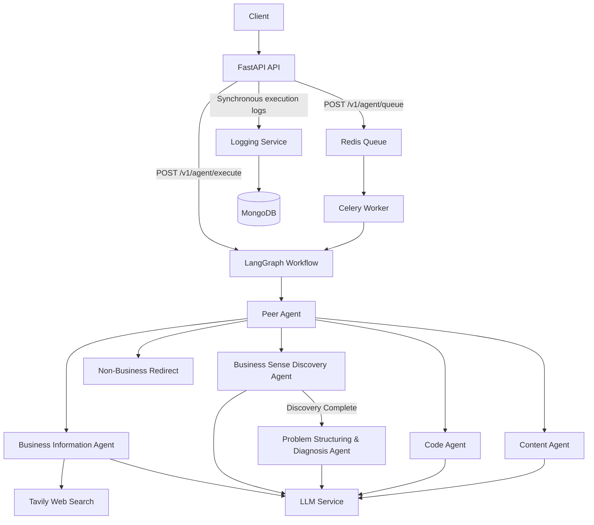

# Entrapeer Agentic API

A modular agentic business assistant API built with FastAPI, LangGraph, Gemini, MongoDB, Redis, and Celery.

The system routes requests through a central Peer Agent and delegates specialized work to dedicated agents for business information, business problem discovery and diagnosis, code tasks, and content tasks.

The project focuses on modularity, structured agent handoffs, observability, asynchronous execution, and extensibility.

---

## Features

- FastAPI REST API
- LangGraph-based agent orchestration
- Central Peer Agent for classification and routing
- Business Information Agent with live web search
- Business Sense Discovery Agent
- Problem Structuring & Diagnosis Agent
- Code Agent
- Content Agent
- Gemini integration through a centralized LLM service
- Tavily integration for current business information and sources
- MongoDB structured logging for synchronous executions
- Session-aware LangGraph execution
- Redis-backed Celery task queue
- Docker and Docker Compose support
- Automated pytest suite
- GitHub Actions CI
- Example AWS CodeDeploy configuration and deployment hooks
- Versioned API design

---

## Architecture

The Peer Agent acts as the central routing layer and delegates requests to specialized agents.



### Routing Philosophy

The Peer Agent is a lightweight control layer rather than a monolithic assistant.

It classifies requests into:

- Business information
- Business problem
- Code
- Content
- Non-business

Business information requests are answered directly without unnecessary discovery.

Business problems are routed into the discovery and diagnosis workflow.

Code and content tasks are delegated to their respective specialist agents.

Non-business requests are redirected toward a business-focused perspective.

This separation keeps specialist behavior independent from routing logic and makes new agents easier to add.

---

## Business Problem Flow

Business problem requests use a two-stage workflow.

### 1. Business Sense Discovery

The Discovery Agent first investigates the stated business problem instead of immediately proposing solutions.

The workflow enforces a minimum of three main discovery questions before diagnosis can begin.

Follow-up questions can adapt to previous answers.

The structured discovery output contains:

- Customer Stated Problem
- Identified Business Problem
- Hidden Root Risk
- Customer Chat Summary

The summary preserves important information collected during the conversation for the diagnosis stage.

### 2. Problem Structuring & Diagnosis

Once discovery is complete, the Problem Structuring & Diagnosis Agent analyzes the collected context without asking new discovery questions.

The problem is classified as:

- Growth
- Cost
- Operational
- Technology
- Regulation
- Organizational
- Hybrid

The resulting problem tree contains:

- Main problem
- 3–5 main causes
- 2–3 sub-causes for each main cause

This structured output can be consumed by future agents or downstream services.

---

## Business Information and Web Search

Business information requests are handled separately from problem discovery.

Examples include:

- Competitor information
- Sector and market trends
- Company information
- Industry developments

The Business Information Agent uses Tavily for current web information when appropriate.

The retrieved context is passed to the LLM to generate a concise and structured business response while preserving relevant source URLs.

This prevents ordinary information requests from unnecessarily entering the discovery workflow.

---

## LLM Integration

LLM access is centralized through `LLMService`.

The current implementation uses Google's Gemini model through `langchain-google-genai`.

Current model:

```text
gemini-3.6-flash
```

Gemini was selected for practical development access, structured-output capabilities, and straightforward LangChain integration.

Individual agents do not directly manage provider configuration. The LLM is wrapped behind a service layer, reducing provider coupling and making a future model replacement easier.

The model is configured with a low/deterministic temperature for predictable agent behavior.

---

## Prompt Engineering

Each agent has a focused responsibility and prompt.

Prompt-engineering principles include:

- Explicit agent roles
- Clear behavioral boundaries
- Structured output expectations
- Separation of discovery and diagnosis
- No premature solutions during discovery
- No discovery questions from the Peer Agent
- Explicit routing categories
- Business-focused behavior
- Source-aware business information responses

Structured outputs and Pydantic models are used where appropriate to make agent behavior and handoffs more predictable.

---

## API

The API is versioned under:

```text
/v1/agent
```

### Health Check

```http
GET /health
```

Example response:

```json
{
  "status": "healthy",
  "service": "entrapeer-agentic-api"
}
```

### Execute Agent Task

```http
POST /v1/agent/execute
```

Example request:

```json
{
  "task": "Our sales have declined during the last quarter. Help us understand why."
}
```

A `session_id` may optionally be supplied to continue an existing conversation:

```json
{
  "task": "Most of the decline is coming from repeat customers.",
  "session_id": "existing-session-id"
}
```

If no session ID is supplied, one is generated.

The response contains execution status, responsible agent, response content, session information, and optional structured data or sources.

---

## Asynchronous Task Queue

An asynchronous execution path is implemented using Celery and Redis.

Tasks can be submitted through:

```http
POST /v1/agent/queue
```

Example request:

```json
{
  "task": "Analyze why our sales are declining."
}
```

Example response:

```json
{
  "status": "queued",
  "task_id": "celery-task-id",
  "session_id": "generated-session-id"
}
```

The queue flow is:

```text
Client -> FastAPI -> Redis -> Celery Worker -> LangGraph -> Agent
```

Redis is configured as the Celery broker and result backend.

The Celery worker runs as a separate Docker Compose service, allowing API and worker execution to be scaled independently.

The required synchronous `/execute` endpoint is intentionally preserved as the primary API contract. The `/queue` endpoint demonstrates asynchronous processing for workloads that should not block the API request.

A production extension would expose task-status/result retrieval and add worker-level retry, failure-handling, and structured logging policies.

---

## Error Handling

Incoming requests are validated using Pydantic.

Empty or whitespace-only tasks are rejected before agent execution.

Agent/model execution failures in the synchronous endpoint are caught and returned as controlled server errors rather than exposing internal stack traces.

Queue submission failures are converted into a service-unavailable response.

Internal errors are printed to stdout for operational visibility.

---

## Structured Logging

MongoDB is used for structured logging of synchronous agent executions.

The log schema includes:

- `session_id`
- `task`
- `agent`
- `status`
- `response`
- `data`
- `sources`
- `error`
- `timestamp`

MongoDB was chosen because agent executions can contain flexible nested structures such as diagnosis data, source lists, and agent-specific metadata.

MongoDB connection lifecycle for the API process is managed through the FastAPI application lifespan.

Logging failures are handled defensively so an unavailable logging database does not unnecessarily break the primary agent workflow.

For production, the same structured logging strategy should be extended to Celery worker execution and centralized observability infrastructure.

---

## Session and Memory

Session-aware execution is implemented using LangGraph checkpointing.

A `session_id` is mapped to LangGraph's `thread_id`, allowing multiple turns in the same discovery conversation to share workflow context.

The current case-study implementation uses in-process checkpoint memory.

For production, this should be replaced with a persistent distributed backend such as Redis or PostgreSQL so state survives process restarts and can be shared by multiple application instances.

---

## Local Setup

### 1. Clone the repository

```bash
git clone <repository-url>
cd entrapeer-agentic-api
```

### 2. Create a virtual environment

Windows:

```bash
python -m venv .venv
.venv\Scripts\activate
```

macOS/Linux:

```bash
python -m venv .venv
source .venv/bin/activate
```

### 3. Install dependencies

```bash
python -m pip install -r requirements.txt
```

### 4. Configure environment variables

Copy `.env.example` to `.env` and provide the required credentials.

Secrets must not be committed to source control.

---

## Run Without Docker

Start FastAPI with:

```bash
uvicorn app.main:app --reload
```

API:

```text
http://127.0.0.1:8000
```

Swagger UI:

```text
http://127.0.0.1:8000/docs
```

---

## Docker

The repository includes:

- `Dockerfile`
- `docker-compose.yml`
- `.dockerignore`

Docker Compose defines:

- `api`
- `worker`
- `mongodb`
- `redis`

Start the stack with:

```bash
docker compose up --build
```

The API service runs FastAPI/Uvicorn.

The worker service runs Celery and consumes tasks from Redis.

MongoDB provides structured log storage for API executions.

Redis provides Celery broker and result-backend infrastructure.

The Compose definition can be statically validated with:

```bash
docker compose config
```

---

## Testing

The project uses `pytest`.

Run:

```bash
python -m pytest -v
```

The current automated suite contains 12 tests covering:

- Health endpoint
- Empty-task validation
- Peer Agent routing
- Business problem routing
- Business information routing
- Code routing
- Content routing
- Non-business routing
- Discovery minimum-question behavior
- Discovery guardrails and handoff
- Diagnosis problem-tree structure
- Queue submission

External infrastructure is mocked where appropriate so the core test suite does not require live Gemini, Tavily, Redis, or MongoDB services.

Future coverage should include:

- Redis/Celery integration tests
- MongoDB integration tests
- Persistent-session tests
- Provider timeout/failure scenarios
- Worker retry behavior
- End-to-end Docker Compose tests
- Concurrency and load tests

---

## Continuous Integration

GitHub Actions is configured under:

```text
.github/workflows/ci.yml
```

The workflow runs on pushes and pull requests to `main`.

It:

1. Checks out the repository
2. Sets up Python 3.11
3. Installs dependencies
4. Executes the pytest suite

This provides automated regression checking for the core application behavior.

---

## Deployment / DevOps Example

The repository contains an example AWS CodeDeploy-style configuration:

```text
appspec.yml
```

Deployment hooks are stored under:

```text
scripts/
```

The hooks include:

- `before_install.sh`
- `start_application.sh`
- `stop_application.sh`

The example deployment uses an application directory such as:

```text
/home/ubuntu/entrapeer-agentic-api
```

The start hook uses Docker Compose to build and start the services.

This is an example deployment configuration and can be adapted to the target environment.

---

## Production Readiness

The case-study implementation already demonstrates:

- Modular agent architecture
- Peer-based routing
- Structured agent outputs
- Centralized LLM abstraction
- Live web-search integration
- Versioned FastAPI endpoints
- Request validation
- Structured MongoDB logging
- Session-aware workflows
- Docker packaging
- Redis/Celery asynchronous execution
- Automated tests
- GitHub Actions CI
- Deployment lifecycle examples

For a full production deployment, the next improvements would include:

- Persistent distributed LangGraph checkpointing
- Authentication and authorization
- API rate limiting
- Queue task-status/result endpoint
- Celery retry policies
- Dead-letter/failure handling
- Task idempotency
- Worker-side structured logging
- Queue monitoring
- Health and readiness probes
- Centralized metrics and tracing
- Secret-manager integration
- Horizontal autoscaling
- Database authentication and backups
- Integration and load testing

---

## API Versioning and Rate Limiting

The API currently uses URL-based versioning:

```text
/v1/agent/...
```

This allows future incompatible changes to be introduced under another API version without breaking existing clients.

Rate limiting is not currently enforced in this case-study implementation.

In production, rate limiting could be implemented at the API gateway or application layer. A Redis-backed limiter would allow limits to remain consistent across multiple API instances.

---

## Extensibility

Agents are implemented as separate modules and coordinated by the central graph.

A new specialist agent can be introduced by:

1. Creating a new agent module
2. Defining its prompt and structured output contract
3. Adding its routing category
4. Registering it in the LangGraph workflow
5. Adding focused routing and behavior tests

Because LLM access, web search, logging, API transport, and queue infrastructure are separated from individual agent responsibilities, specialist agents remain relatively small and focused.

This is the primary benefit of the Peer Agent architecture compared with implementing all behavior inside one monolithic prompt.

---

## Security

Secrets are loaded from environment variables.

The local `.env` file is excluded from Git and should never be committed.

A production environment should use a dedicated secret-management system instead of storing secrets in plain environment files.

Authentication and authorization should also be introduced before exposing the API publicly.

---

## Current Limitations

- Session checkpoint memory is in-process rather than persistent.
- Rate limiting is documented but not implemented.
- The asynchronous API currently submits tasks but does not expose a task-status/result endpoint.
- Worker-side MongoDB structured logging is not yet implemented.
- Celery production retry/dead-letter policies are not configured.
- Production authentication and authorization are not implemented.
- External LLM and web-search availability depends on third-party providers.
- Full Docker runtime integration still requires environment-specific validation.

These limitations are explicitly documented so the path from the case-study implementation to a production architecture remains clear.

---

## Technology Stack

- Python 3.11
- FastAPI
- Pydantic
- LangGraph
- LangChain
- Google Gemini
- Tavily
- MongoDB
- Redis
- Celery
- Docker
- Docker Compose
- pytest
- GitHub Actions