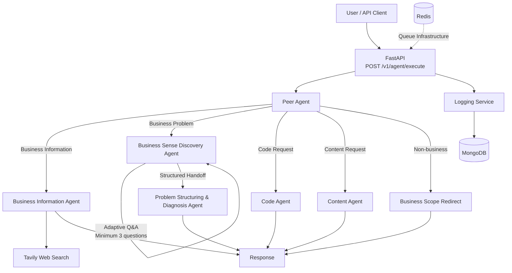

# Entrapeer Agentic API

A modular, business-focused multi-agent API built with FastAPI, LangGraph, Google Gemini, and Tavily.

The system routes incoming requests through a Peer Agent and delegates them to specialized agents for business information, business problem discovery and diagnosis, code generation, and content generation.

## Features

- Business-focused Peer Agent routing
- Current business information with web search and visible sources
- Multi-turn Business Sense Discovery flow
- Minimum three-question discovery guardrail
- Structured Problem Diagnosis and Problem Tree generation
- Code Agent
- Content Agent
- Non-business request redirection
- Session-aware LangGraph workflow
- Structured Pydantic outputs
- FastAPI REST API
- MongoDB structured logging
- Docker and Docker Compose support
- Redis infrastructure for asynchronous task processing
- Automated tests with pytest
- GitHub Actions CI pipeline

## Architecture



### Agent Routing

The Peer Agent is the entry point of the agent system. It classifies requests into the following categories:

- `business_information`
- `business_problem`
- `code`
- `content`
- `non_business`

The Peer Agent does not perform business problem discovery itself. Business problem requests are delegated to the Business Sense Discovery Agent.

The architecture is intentionally modular. New specialized agents can be added by implementing the agent module and adding a corresponding routing path to the LangGraph workflow.

## Business Problem Flow

Business problem requests use a stateful multi-turn workflow:

1. The Peer Agent identifies the request as a business problem.
2. The Business Sense Discovery Agent starts an adaptive Q&A process.
3. At least three main discovery questions must be asked before diagnosis.
4. The Discovery Agent produces a structured handoff containing:
   - Customer Stated Problem
   - Identified Business Problem
   - Hidden Root Risk
   - Customer Chat Summary
5. The Problem Structuring & Diagnosis Agent analyzes the handoff without asking additional questions.
6. Diagnosis returns:
   - Problem Type
   - Main Problem
   - 3–5 Main Causes
   - 2–3 Sub-causes for each main cause

Conversation state is preserved using a LangGraph checkpointer and `session_id`.

The current implementation uses in-process memory for development. A durable external checkpointer would be recommended for a production deployment.

## Business Information and Web Search

Business information requests are handled separately from the discovery workflow.

The Business Information Agent uses Tavily to retrieve current web information and returns visible source references with the response.

This flow is intended for questions involving:

- competitors
- sector information
- market trends
- company information
- general business information

## LLM Integration

Google Gemini is accessed through `langchain-google-genai`.

The project currently uses:

`gemini-3.6-flash`

Gemini was selected for development because it provides practical free-tier access and supports the structured-output workflow required by the agents.

LLM access is centralized through an LLM service abstraction so the provider/model can be replaced without rewriting the agent architecture.

For a production environment, model selection should be based on latency, reliability, structured-output performance, cost, and quota requirements.

## Prompt Engineering

Agent prompts are separated by responsibility and designed around explicit behavioral constraints.

Examples include:

- Peer Agent must classify and route rather than perform discovery.
- Discovery Agent must ask questions before proposing analysis or solutions.
- Discovery cannot complete before the minimum question threshold.
- Diagnosis must not ask new questions.
- Diagnosis must produce a constrained structured problem tree.
- Non-business requests are redirected toward a business perspective.

Pydantic structured outputs are used where possible to reduce ambiguous model responses and make downstream processing deterministic.

## API

### Health Check

```http
GET /health
```

### Execute Agent

```http
POST /v1/agent/execute
Content-Type: application/json
```

Example request:

```json
{
  "task": "Python ile bir dosyayı okuyup yazan kod yaz.",
  "session_id": "example-session"
}
```

`session_id` is optional. If it is not provided, the API generates one automatically.

Example response structure:

```json
{
  "status": "completed",
  "agent": "code_agent",
  "response": "...",
  "session_id": "example-session",
  "data": null,
  "sources": null
}
```

For multi-turn discovery conversations, clients should reuse the same `session_id`.

## Error Handling

The API handles:

- empty or whitespace-only tasks through Pydantic validation
- agent/model execution failures
- structured routing constraints
- safe HTTP 500 responses without exposing internal exception details

Internal errors are written to stdout for development diagnostics.

MongoDB logging failures are isolated from the main agent workflow so a logging outage does not prevent the API from responding.

## Structured Logging

Agent executions are structured for MongoDB logging.

Log entries can contain:

- session ID
- task
- selected agent
- status
- response
- structured data
- sources
- error information
- UTC timestamp

MongoDB is used because agent interactions naturally contain nested and evolving structured data, making a document-oriented store suitable for observability and later analysis.

## Local Setup

### Requirements

- Python 3.11+
- pip

Create and activate a virtual environment.

Windows PowerShell:

```powershell
python -m venv .venv
.\.venv\Scripts\Activate.ps1
```

Install dependencies:

```powershell
python -m pip install -r requirements.txt
```

Create a `.env` file based on `.env.example`.

Required configuration includes:

```env
GOOGLE_API_KEY=your_google_api_key
TAVILY_API_KEY=your_tavily_api_key
MONGODB_URI=mongodb://mongodb:27017
MONGODB_DB_NAME=entrapeer
REDIS_URL=redis://redis:6379/0
APP_ENV=development
LOG_LEVEL=INFO
```

Never commit the real `.env` file.

## Run Without Docker

Start the FastAPI application:

```powershell
python -m uvicorn app.main:app --reload
```

Swagger documentation:

`http://127.0.0.1:8000/docs`

Health endpoint:

`http://127.0.0.1:8000/health`

## Docker

The repository includes:

- `Dockerfile`
- `docker-compose.yml`
- `.dockerignore`

The Compose architecture includes:

- FastAPI application
- MongoDB
- Redis

Run the stack with:

```bash
docker compose up --build
```

Stop it with:

```bash
docker compose down
```

MongoDB data is persisted through a Docker volume.

## Testing

Run the automated test suite with:

```powershell
python -m pytest -v
```

The current automated tests cover:

- API health check
- empty task validation
- all Peer Agent routing categories
- Discovery Agent question behavior
- minimum discovery-question guardrail
- discovery-to-diagnosis handoff
- Diagnosis problem-tree structure

External LLM calls are mocked in automated unit tests where appropriate. This makes tests deterministic and prevents CI from depending on external API quotas.

### Increasing Test Coverage

Production-oriented improvements would include:

- integration tests for the full LangGraph workflow
- MongoDB integration tests
- web-search failure tests
- model timeout/retry tests
- queue worker tests
- concurrent session tests
- load and rate-limit tests

## Continuous Integration

GitHub Actions runs the automated test suite on pushes and pull requests to `main`.

The workflow:

1. checks out the repository
2. configures Python 3.11
3. installs dependencies
4. executes pytest

External LLM calls used by the tested components are mocked, keeping CI deterministic.

## Production Readiness

The current project is designed as a case-study implementation rather than a fully deployed production platform.

Recommended production improvements include:

- durable LangGraph checkpoint storage
- authenticated API access
- Redis-backed asynchronous task queue
- worker scaling
- API rate limiting
- retry and exponential backoff for LLM/search providers
- centralized production logging and monitoring
- secrets management
- MongoDB authentication
- health/readiness checks for external dependencies
- request tracing and latency metrics
- container resource limits
- stronger source-quality filtering
- expanded integration and load testing

## API Versioning and Rate Limiting

The API is versioned under `/v1`.

For production, additional versions should be introduced rather than introducing breaking changes to existing clients.

Rate limiting should be applied at the API gateway or application layer, ideally backed by Redis for distributed deployments.

## Extensibility

The system separates routing, orchestration, specialized agents, schemas, external services, and persistence concerns.

A new agent can be introduced by:

1. implementing the agent in `app/agents`
2. defining structured schemas where required
3. extending Peer Agent routing
4. adding a LangGraph node and routing edge
5. adding focused automated tests

This keeps new capabilities isolated from existing agent implementations.

## Security

- Secrets are stored in environment variables.
- `.env` is excluded from Git and Docker build context.
- Internal exceptions are not returned directly to API clients.
- Production deployments should use a dedicated secrets manager and authenticated database connections.

## Current Limitations

- Development session memory is in-process and is lost after application restart.
- Free-tier LLM quotas can temporarily limit live model requests.
- Queue processing and distributed worker execution require further production hardening.
- Source trust/ranking can be improved beyond basic web-search retrieval.

## Technology Stack

- Python 3.11
- FastAPI
- Pydantic v2
- LangGraph
- LangChain
- Google Gemini
- Tavily
- MongoDB
- Redis
- pytest
- Docker / Docker Compose
- GitHub Actions